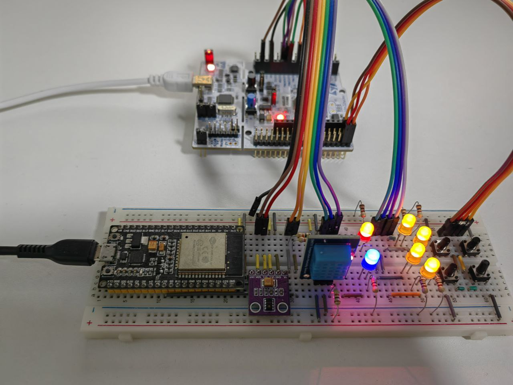
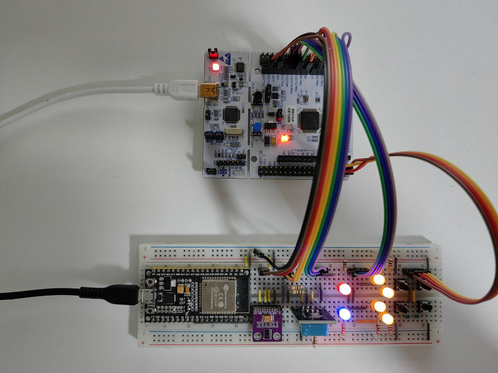
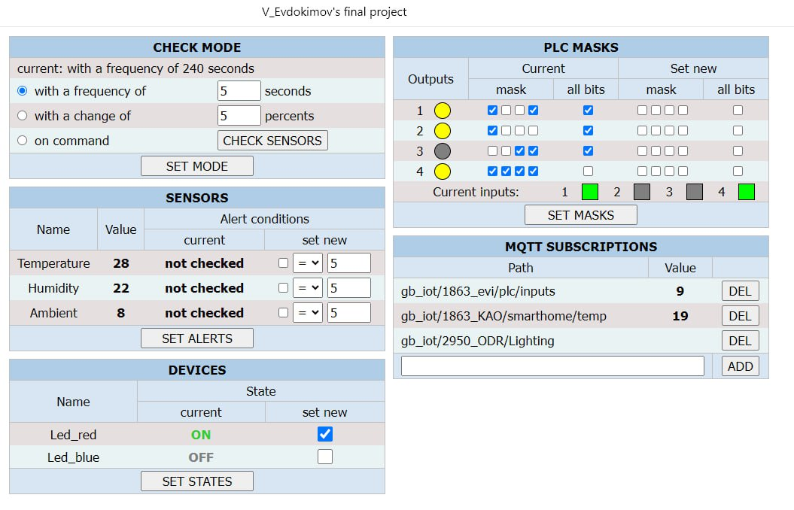

# iot_project
Device functionality:
- collecting information about temperature and humidity from the DHT11 sensor, ambient data from the APDS9930 sensor;
- collection of data on the state of user inputs;
- data visualization, as well as provision of system configuration tools in the web interface;
- setting the frequency of data collection from sensors;
- setting up parameters for notifying the user about reaching the limit values of sensor readings;
- setting up activation parameters for user outputs depending on the state of the inputs;
- turning on/off external control devices;
- optional transmission of device state data to the MQTT broker;
- subscription to MQTT broker topics and receiving data.

